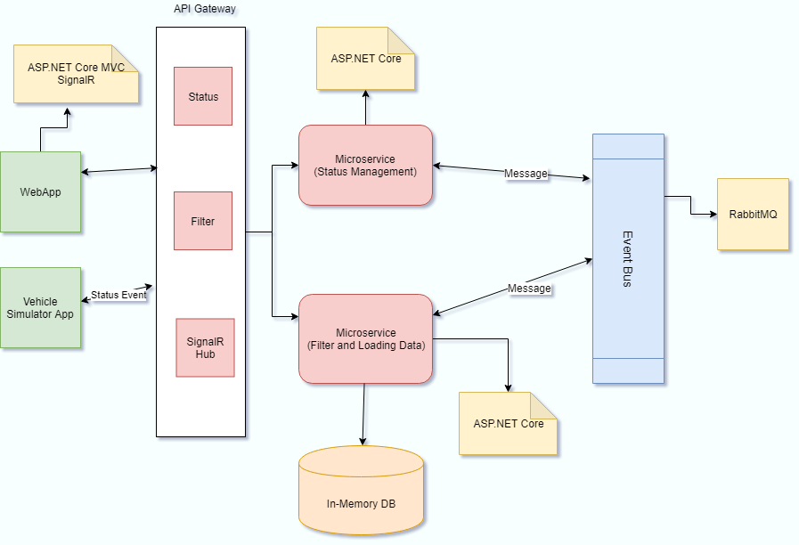
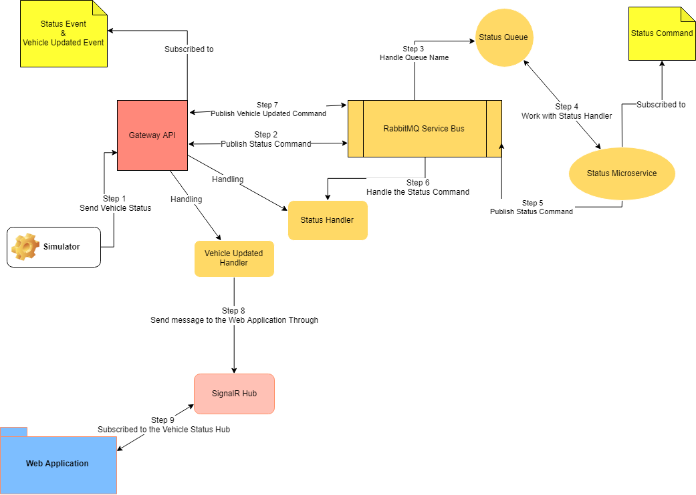

# Vehicle Tracking System

## Introduction

Here I am implementing Vehicle Tracking System using some of the technologies to let the clients view Vehicle status may be Connected or Disconnected, also fixed the problem using Microservice architecture.

## Scenario

- They have a number of connected vehicles that belongs to a number of customers.
- They have a need to be able to view the status of the connection among these vehicles on a monitoring display.
- The vehicles send the status of the connection one time per minute.
- The status can be compared with a ping (network trace); no request from the vehicle means no connection.
- So, vehicle is either Connected or Disconnected.

## Requirements

- Microsoft Visual Studio 2017
- .NET Core 2.2
- RabbitMQ

## Technologies

- .NET Core & ASP.NET Core MVC
- ASP.NET Core SignalR
- In-Memory Database
- EntityFramework Core
- Unit Testing
- RawRabbit 1.10.4

## Full architectural

## Solution Analysis

I have implemented this solution using Event bus through RabbitMQ and also there is 2 Microservices, Status Microservice subscribed to 'Status Command', and Data Microservice subscribed to 'Data Command', let me first give you some structure here before we getting started with these 2 Microservices.

- ### Simulator APP

 	- Send request to GatewayAPI random status every 1 minute.

- ### GatewayAPI

	- Subscribed to 2 Events 'Status Changed Event' and 'Update Vehicle Event'.
	- Has 2 Handlers, 'Status Changed Event Handler' and 'Vehicle Updated Handler'.
	- publish 'Status Command' to the RabbitMQ then RMQ handle the queue to the subscribed 'Status Microservice'.
	- 'Status Changed Event Handler' to receive published event from 'Status Microservice'.
	- 'Vehicle Updated Handler' to receive published event from 'Data Microservice'.
	- Handle the filtration request.
	- After receiving the 'Status Change Event' from the 'Status Microservice', call the 'Data Microservice' to update the Vehicle status into the In-Memory Database.
	- Creates SignalR hub to publish the changes with Client's.

- ### Status Microservice

	- Subscribed to 1 Command 'Status Change Command'.
	- Has 1 Handler to handle the received 'Status Change Command'.
	- Publish 'Status Changed Event' to the GatewayAPI Handler.

- ### Data Microservice

	- Subscribed to 1 Command 'Vehicle Update Command'.
	- Has 1 Handler to handle the received 'Vehicle Update Command'.
	- Hanlde the filtration request from GatewayAPI.
	- Save customers vehicles to 'In-Memory' Database.
	- Publish 'Vehicle Updated Event' to the GatewayAPI Handler.

- ### Client Web Application

	- List all vehicles and it's status, Connected or Disconnected.
	- Subscribed to 'SignalR' hub with the 'GatewayAPI'.
	- Receive the Vehicle's status changes. 

## Setup
	- Use visual studio or visual studio code.
	- Or simply run 'Run.ps1' script via PowerShell and it will run all projects.
	- Simply you can access the web application via 'https://localhost:44323/Home'

## Online Demo
	- Not available till now.